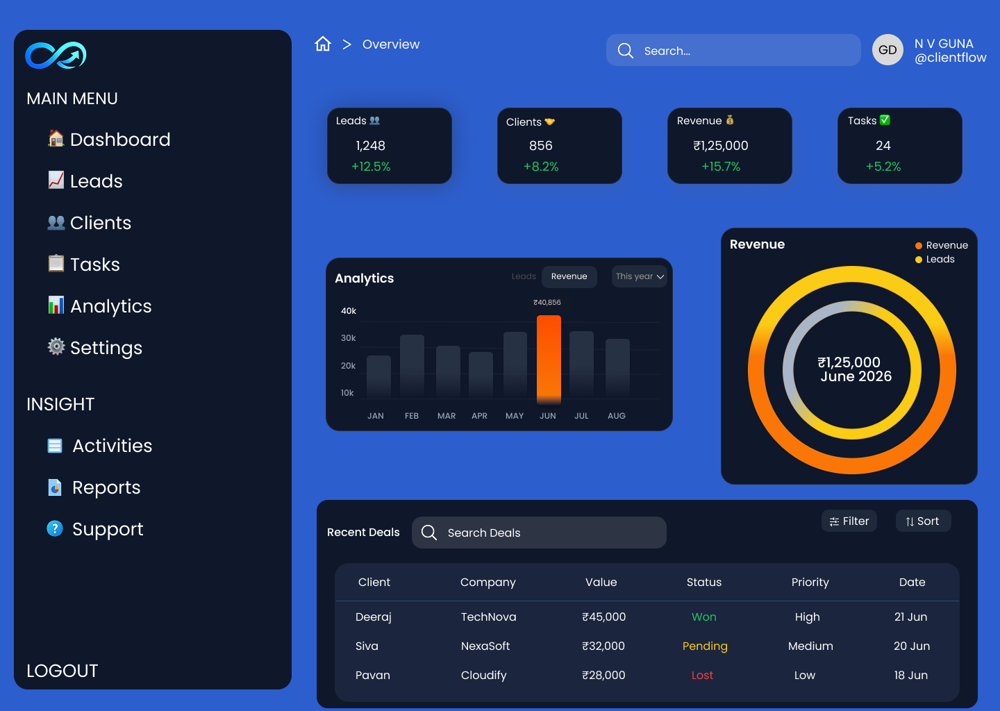

# 📊 ClientFlow CRM Dashboard – UI/UX Design

## 📌 Project Overview

ClientFlow CRM Dashboard is a modern web-based CRM dashboard UI/UX design created in **Figma**. The dashboard is designed to help businesses efficiently manage leads, clients, sales performance, revenue analytics, and daily tasks through an intuitive and visually engaging interface.

The design focuses on usability, productivity, and data visualization, enabling users to monitor business performance at a glance.

---

## 📸 Screenshot

### CRM Dashboard



## 🎯 Features

- Dashboard Overview
- Lead Management
- Client Management
- Revenue Analytics
- Task Monitoring
- Interactive Charts
- Recent Deals Table
- Search & Filter
- Responsive Dashboard Layout
- Modern UI Components

---

## 📊 Dashboard Modules

| Module | Description |
|---------|-------------|
| Dashboard | Business overview and statistics |
| Leads | Track and manage sales leads |
| Clients | Manage customer information |
| Revenue | Monitor business revenue |
| Tasks | View pending and completed tasks |
| Analytics | Performance insights with charts |
| Recent Deals | Track latest client deals |
| Reports | Business reports |
| Settings | User preferences and configurations |

---

## 🎨 Design Tools

- Figma
- UI Design
- Dashboard Design
- Auto Layout
- Components & Variants
- Prototyping

---

## ✨ Design Highlights

- Modern CRM Dashboard
- Clean Dark Theme
- Professional Blue Color Palette
- Interactive Data Visualization
- Responsive Web Layout
- Business Analytics
- User-Friendly Navigation
- Minimal & Scalable Design

---

## 📈 Dashboard Widgets

- Total Leads
- Active Clients
- Revenue Summary
- Task Overview
- Monthly Revenue Chart
- Revenue Analytics
- Search Deals
- Recent Deals Table
- Filters & Sorting

---

## 🔗 Figma Links

### 🎨 Design File

https://www.figma.com/design/wQhhGd3hRDtnDIOnaukegi/Task3?node-id=0-1&t=vfijbmMBtV1LVoLU-1

### 🖥️ Interactive Prototype

https://www.figma.com/proto/wQhhGd3hRDtnDIOnaukegi/Task3?node-id=0-1&t=vfijbmMBtV1LVoLU-1

---

## 📂 Repository Structure

```text
ClientFlow-CRM/
│── README.md
│── Screenshots/
│   └── Dashboard.png
```

---

## 👨‍💻 Designed By

**N V GUNADEEP REDDY**

UI/UX Internship Project

2026

---

